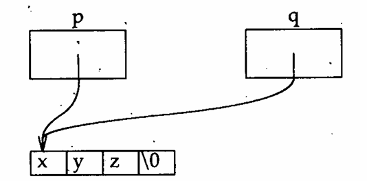

# Semantic Pitfalls

A sentence can be perfectly spelled and written with impeccable grammar and still have an ambiguous or unintentional meaning. This chapter looks at ways of writing programs that look like they mean one thing but actually mean something quite different.

## Pointers and arrays

The C notions of pointers and arrays are inseparably joined, to the extent that it is impossible to understand one thoroughly without also understanding the other. Moreover, C treats some aspects of these notions differently from any other well-known language.

Two things stand out about C arrays:

- C has only one-dimensional arrays, and the size of an array must be fixed as a constant at compilation time. However, an element of an array may be an object of any type, including another array; this makes it possible to simulate multi-dimensional arrays fairly easily.
- Only two things can be done to an array: determine its size and obtain a pointer to element 0 of the array. All other array operations' are actually done with pointers, even if they are written with what look like subscripts. That is, every subscript operation is equivalent to a pointer operation, so it is possible to define the behavior of subscripts entirely in terms of the behavior of pointers.

Once these two points and all their implications are thoroughly understood,.C array operations become much easier. Until then, they can be a rich source of confusion. In particular, it is important to be able to think about array operations and their corresponding pointer operations interchangeably. Indexing is built into most other languages; in C it is defined in terms of pointer arithmetic.

On the way to understanding how arrays work, we must understand how to declare them. For example,

```c
int a[3];
```

says that a is an array of three int elements. Similarly,

```c
struct {
    int p[4];
    double x;
} b[17];
```

says that `b` is an array of 17 elements, each of which is a structure containing an array (named `p`) of four `int` elements and a `double` value (named `x`).

Now consider

```c
int calendar[12][31];
```

This says that calendar is an array of 12 arrays of 31 `int` elements each (not an array of 31 arrays of 12 `int` elements each), so that `sizeof(calendar)` is $372 (31 \times 12)$ times `sizeof(int)`.

If the name calendar is used in just about any context other than as the operand of `sizeof`, it is converted to a pointer to the initial element of calendar. To understand what this means, we must first understand some details about pointers.

Every pointer is a pointer to *some type*. For instance, if we write

```c
int *ip;
```

 we have said that `ip` is a pointer to an `int` if we now say

```c
int i;
```

we can assign the address of `i` to `ip` by saying

```c
ip = &i;
```

and then we can change the value of `i` by assigning to `*ip`:

```c
*ip = 17;
```

If a pointer happens to point to an element of an array, we can add 1 to that pointer to obtain a pointer to the next element of that array. Similarly, we can subtract 1 from the pointer to obtain a pointer to the previous element of that array, and so on for other integers.

This implies that adding an integer to a pointer is generally different from adding that integer to the bit representation of that pointer! If `ip` points to an integer, `ip + 1` points to the next integer in the machine's memory, which, for most modern computers, is not the next memory location.

We can also subtract one pointer from another, provided that both of them point to elements of the same array.

This makes good sense. If we have written

```c
int *q = p + 1
```

then we should be able to obtain `i` by writing `q-p`. Notice that if `p` and `q` don't point to elements of the same array, there is no way to guarantee even that the distance between `p` and `q` is an integral multiple of an array element!

We have already defined a as an array of three `int` values. If we use the name of an array where a pointer is appropriate, that name is taken to mean a pointer to element 0 of that array. Thus if we write

```c
p = a;
```

we will set p to the address of element 0 of a. Notice that we did not say

```c
p = &a;
```

That is illegal in ANSI C because `&a` is a pointer to an array but `p` is a pointer to an int. In most earlier versions of C, there is no notion of the address of an array. `&a` is either illegal or equivalent to `a`.

Now that `p` points to element 0 of `a`, `p+1` points to element 1, `p+2` to element 2, and so on. We can therefore make `p` point to element 1 by saying

```c
p = p + 1;
```

which, of course, is equivalent to saying

```c
p++;
```

The name `a` refers to the address of element 0 of `a` in every context but one: when a is used as an argument to the `sizeof` operator. There, `sizeof(a)` does what one would reasonably expect: it yields the size of the entire array `a` and not the size of a pointer to one of its elements!

One implication of all this is that it is possible to write *a as a reference to element 0 of `a`:

```c
*a = 84;
```

sets element 0 of a to 84. In a similar vein, `*(a+ 1)` refers to element 1 of `a`, and so on. In general, it is possible to refer to element `i` of `a` by writing `*(a+i)`; this notion is so common that it is abbreviated as `a[i]`.

it is precisely this idea that is so hard for new C programmers to understand: In fact, since `a+i` and `i+a` mean the same thing, `a[i]` and `i[a]` also mean the same thing. The latter usage is definitely not recommended, although some assembly language programmers may find it familiar.

We can now think about "two-dimensional arrays," which, as we have already seen, are really arrays of arrays. while it is not hard to write programs that. manipulate one-dimensional arrays purely in terms of pointers, the notational convenience of subscripts becomes nearly essential for two-dimensional arrays. Moreover, using only pointers to manipulate arrays leads us into some of the darker corners of the language, where compiler bugs are likely to lurk.

Consider again the declarations

```c
int calendar[12][13];
int *p;
int i;
```

and ask yourself what might be the meaning of `calendar[4]`?

Since `calendar` is an array of 12 arrays of 31 `int` elements each, `calendar[4]` is simpiy element 4 of that array. Thus `calendar[4]` is one of the 12 arrays of 31 int elements in `calendar` and behaves exactly that way. So, for instance; `sizeof(calendar[4])` is 31 times the size of an `int`, arid the effect of saying

```c
p = calendar[4];
```

is to make `p` point to element 0 of the array `calendar[4]`.

If `calendar[4]` is an array, we should be able to subscript it and say

```c
 i = calendar[4][7];
```

and indeed we can. Again, this statement is precisely equivalent to saying

```c
i = *(calendar[4]+7)
```

 which in turn is equivalent to

```c
i = *(*(calendar + 4) + 7)
```

 Here the bracket notatlon IS clearly more convenient.

 Now look at

```c
p = calendar;
```

This statement is illegal because `calendar` is an array of arrays; using the name `calendar` in this context therefore converts it to a pointer to an array. Since `p` is a pointer to an `int`, we are trying to assign a pointer of one type to a pointer of another type.

Apparently, we need a way to declare a pointer to an array:

```c
int (*ap)[31];
```

In effect, we are saying here that `*ap` is an array of 31 int elements, so `ap` is a pointer to such an array. We can therefore write

```c
int calendar[12][31];
int (*monthp)[31];
monthp = calendar;
```

and `monthp` will then point to the first of the 12 31-element arrays that are the elements of `calendar`.

Suppose a new year is beginning and we want to clear the calendar. This is easy to do with subscripts:

```c
int month;
for(month = 0; month < 12; month++){
    int day;
    for(day = 0; day < 31; day++){
        calendar[month][day] = 0;
    }
}
```

What is happening here in terms of pointers? It is easy enough to treat

```c
calendar[month][day] = 0;
```

as 

```c
*(*(calendar + month) + day) = 0;
```

but what is really involved?

If `monthp` points to an array of 31 int values, it is possible to step `monthp` through `calendar` just as with any other pointer:

```c
int (*monthp)[31];
for(monthp = calendar; monthp < &calendar[12], monthp++){
    int *dayp;
    for(dayp = *month; dayp < &(*month)[31]; dayp++){
        *dayp = 0;
    }
}
```

At this point we have walked far enough out on the ice that we had better turn back before falling through; although. this last example is valid ANSI C, I had trouble finding a compiler that would accept it. The point of this excursion has been to illustrate the unique relationship in C between arrays and pointers, with the aim of shedding more light on both.

## Pointers are not arrays

A character string constant in C represents the address of an area of memory that holds the characters in the constant, followed by a null character (`'\0'`). Because the language prescribes null terminators for string constants, C programmers usually use that convention for other strings as well.

Suppose we have two such strings `s` and `t`, and we want to concatenate them into a single string `r`. To do this, we have the usual library functions `strcpy` and `strcat`. The following obvious method doesn't work:

```c
char *r;
strcpy(r, s);
strcat(r, t);
```

The reason it doesn't work is that `r` doesn't point anywhere. Moreover, in order to make `r` point somewhere, it must have a place to point; that memory must be allocated somehow.

Let's try again, allocating some memory for `r`:

```c
char r[100];
strcpy(r, s);
strcat(r, t);
```

This now works as long as the strings pointed to by `s` and `t` aren't too big. Unfortunately, C requires us to state the size of an array as a constant, so there is no way to be certain that `r` will be big enough. However, most C implementations have a library function called `malloc` that takes a number and allocates enough memory for that many characters. There is also usually a function called `strlen` that tells how many characters are in a string. It might seem, therefore, that we could write:

```c
char *r, *malloc();

r = malloc(strlen(s) + strlen(t));
strcpy(r, s);
strcat(r, t);
```

This example, however, fails for three reasons. First, `malloc` might be unable to provide the requested memory, an event that it signals by returning a null pointer. Second, it is important to remember to free the memory allocated for `r` when done with it. Because the previous program declared `r` as a local variable, `r` was freed automatically. The revised program allocates memory explicitly and must therefore free it explicitly. Third, and most important, is that the call to `malloc` doesn't allocate quite enough memory. Recall the convention that a string is terminated by a null character. The `strlen` function returns the number of characters in the argument string, excluding the null character at the end. Therefore, if `strlen(s)` is `n`, `s` really requires `n+1` characters to contain it. We must thus allocate one extra character for `r`. After doing this and checking that `malloc` worked, we get:

```c
char *r, *malloc();
r = malloc(strlen(s) + strlen(t) + 1);
if(!r){
    complain();
    exit();
}
strcpy(r, s);
strcat(r. t);

/* some time later */

free(r);
```

## Array declarations as parameters

There is no way to pass an array to a function directly. Using an array name as an argument immediately converts it to a pointer to the initial element of the array. For example, writing:

```c
char hello[] = "hello";
```

declares hello as an array of characters. Passing that array to a function:

```c
printf("%s\n", hello);
```

is precisely equivalent to passing the address of its initial character:

```c
printf("%s\n", &hello[0]);
```

Thus it is never meaningful to use an array as a function parameter. For this reason, **C automatically converts an array parameter declaration to the corresponding pointer declaration**. In other words, writing

```c
int strlen(char s[]){
    /* stuff */
}
```

is precisely equivalent to writing

```c
int strlen(char *s){
    /* stuff */
}
```

C programmers often suppose, incorrectly, that this automatic conversion applies in other contexts as well:

```c
extern char *hello;
```

is definitely not the same as

```c
 extern char hello[];
```

If a pointer parameter does not represent an array, it is misleading, although technically correct, to use the array notation. What about pointer parameters that do represent arrays? One common example is the second argument to main:

```c
main(int argc, char* argv[]) {/* stuff */}
```

This is equivalent to

```c
main(inr argc, char** argv) {/* stuff */}
```

but the former example emphasizes the idea that `argv` is a pointer to the initial element of an array of character pointers. Because these two notations are equivalent, you can choose whichever expresses your intent most clearly.

## Eschew synecdoche

A synecdoche (Sin-ECK-duh-key) is a literary device, somewhat like a simile or a metaphor, in which, according to the Oxford English Dictionary, "a more comprehensive term is used for a less comprehensive or vice versa; as whole for part or part for whole, genus for species or species for genus, etc."

ThIs exactly describes the common C pitfall of *confusing a pointer with the data to which it points*. This is most common for character strings. For instance:

```c
char *p, *q;
p = "xyz";
```

It is important to understand that while it is sometimes useful to think of the value of `p` as the string `xyz` after the assignment, this is not really true. Instead, the value of `p` is a pointer to the 0th element of an array of four characters, whose values are `'x'`, `'y'`, `'z'`, and `'\0'`. Thus, if we now execute

```c
q = p;
```

`p` and `q` are now two pointers to the same part of memory. The characters in that memory did not get copied by the assignment. The situation now looks like this:



The thing to remember is that copying a pointer does not copy the thing it addresses.

Thus, if after this we were to execute

```c
q[1] = 'Y';
```

`q` would point to memory containing the string `xYz`. So would `p`, because `p` and `q` point to the same memory.

## Null pointers are not null strings

The result of converting an integer to a pointer is implementation dependent, with one important exception. That exception is the constant 0, which is guaranteed to be converted to a pointer that is unequal to any valid pointer. For documentation, this value is often given symbolically:

```c
#define NULL 0
```

but the effect is the same. The important thing to remember about 0 when used as a pointer is that it must never be dereferenced. In other words, when you have assigned 0 to a pointer variable, you must not ask what is in the memory it addresses. It is valid to write:

```c
if(p == (char*)0) ...
```

but it is not valid to write:

```c
if(strcmp(p, (char*)0) == 0) ...
```

because `strcmp` always looks at the memory addressed by its arguments.

If `p` is a null pointer, even the effects of

```c
printf(p);
```

and 

```c
printf("%s",p);
```

are undefined. Moreover, statements like these may have different effects on different machines. 


## Counting and asymmetric bounds


## Order of evaluation


## The `&&`, `||`, and `!` operators


## Integer overflow


## Returning a value from main


